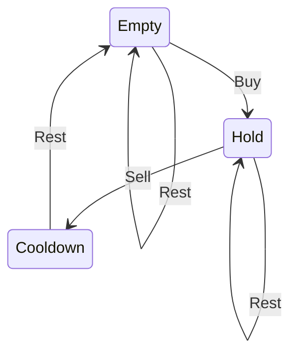

# 309. Best Time to Buy and Sell Stock with Cooldown

https://leetcode.com/problems/best-time-to-buy-and-sell-stock-with-cooldown/

---

# Description

Say you have an array for which the $i^{\text{th}}$ element is the price of a given stock on day $i$.

Design an algorithm to find the maximum profit. You may complete as many transactions as you like (ie, buy one and sell one share of the stock multiple times) with the following restrictions:

- You may not engage in multiple transactions at the same time (ie, you must sell the stock before you buy again).
- After you sell your stock, you cannot buy stock on next day. (ie, cooldown 1 day)

**Example**:

<pre><code>
<b>Input</b>: [1,2,3,0,2]
<b>Output</b>: 3
<b>Expanation</b>: transactions = [buy, sell, cooldown, buy, sell]
</code></pre>

---

# Solution

## 1. Dynamic Programming 1

State: price of each day, remaining transactions. Choice: the day to buy and sell. DP[k][i]: maximal profit sell at day i when finishing kth transaction.

Base case: DP[0][0] = 0

DP[k][i] = max((hold) DP[k][i-1], (sell) max_j(profit_when_buy_on_day[j]))

The profit when buy a share on day j and sell on day i is profit on day j-1 plus the price on day i minus the price on day j: DP[k-1, j-1] + prices[i] - prices[j].

If k is larger than len(prices)/2, then we can make maximal profit by catch every change.

**Python**
```python
class Solution:
    def maxProfit(self, prices: List[int]) -> int:
        if len(prices) <= 1: return 0
        # DP
        # DP[k][i] max profit at day i after k transactions
        max_k = len(prices) // 2
        DP = [[0 for _ in range(len(prices))] for _ in range(max_k+1)]
        for k in range(1, max_k+1):
            DP[k][1] = max(prices[1]-prices[0], 0)
            min_j = min(prices[0], prices[1])
            for i in range(2, len(prices)):
                # DP[k][j] = max((skip) DP[k][i-1], (sell when buy at day j) max(prices[i] - prices[j] + DP[k-1][j-2]))
                # max(prices[i] - prices[j] + DP[k-1][j-2]) = prices[i] - min(prices[j] + DP[k-1][j-2])
                min_j = min(min_j, prices[i] - DP[k-1][i-2])
                DP[k][i] = max(prices[i] - min_j, DP[k][i-1])
        return DP[-1][-1]
```

**Time Complexity** : $O(kn)$

**Space Complexity** :$O(kn)$ (**Python**)

## 2. State Machine Thinking

Ref: https://leetcode.com/problems/best-time-to-buy-and-sell-stock-with-cooldown/discuss/75942/4-line-Python-solution-52-ms

In this question, there are three states and five edges in the state transition.



3 states are notHold (stock), hold (stock), and notHold_cooldown. The initial values of the latter two are negative infinity since they are meaningless, i.e. you won't hold stocks at first and there's no cooldown at first.

For DP, dp[i][0] is the max account balance if there is no stock on hold; dp[i][1] is the max account balance if there is a stock on hold.

**Python 1**
```python
class Solution:
    def maxProfit(self, prices: List[int]) -> int:
        notHold, notHold_cooldown, hold = 0, float('-inf'), float('-inf')
        for p in prices:
            hold, notHold, notHold_cooldown = max(hold, notHold - p), max(notHold, notHold_cooldown), hold + p
        return max(notHold, notHold_cooldown)
```

**Python 2**
```python
class Solution:
    def maxProfit(self, prices: List[int]) -> int:
        if len(prices) <= 1: return 0
        
        # DP[i][j] max_profit at day i, where holding for j = 1 and not for j = 0
        DP = [[0,0] for _ in range(len(prices)+1)]
        DP[1][1] = -prices[0]
        for i in range(2, len(prices)+1):
            # unhold = max(unhold, sell)
            DP[i][0] = max(DP[i-1][0], DP[i-1][1] + prices[i-1])
            # hold = max(hold, buy)
            DP[i][1] = max(DP[i-1][1], DP[i-2][0] - prices[i-1])
        return DP[-1][0]
```

**Time Complexity** : $O(n)$

**Space Complexity** :$O(1)$ (**Python 1**) | $O(n)$ (**Python 2**)