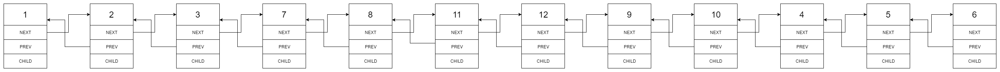

# 430. Flatten a Multilevel Doubly Linked List

https://leetcode.com/problems/flatten-a-multilevel-doubly-linked-list/

---

# Description

You are given a doubly linked list which in addition to the next and previous pointers, it could have a child pointer, which may or may not point to a separate doubly linked list. These child lists may have one or more children of their own, and so on, to produce a multilevel data structure, as shown in the example below.

Flatten the list so that all the nodes appear in a single-level, doubly linked list. You are given the head of the first level of the list.

**Example 1**:

<pre><code>
<b>Input</b>: head = [1,2,3,4,5,6,null,null,null,7,8,9,10,null,null,11,12]
<b>Output</b>: [1,2,3,7,8,11,12,9,10,4,5,6]
<b>Expanation</b>:

The multilevel linked list in the input is as follows:


After flattening the multilevel linked list it becomes:

</code></pre>

**Example 2**:

<pre><code>
<b>Input</b>: head = [1,2,null,3]
<b>Output</b>: [1,3,2]
<b>Expanation</b>:

The input multilevel linked list is as follows:

  1---2---NULL
  |
  3---NULL
</code></pre>

**Example 3**:

<pre><code>
<b>Input</b>: head = []
<b>Output</b>:[]
</code></pre>

**How multilevel linked list is represented in test case**:

We use the multilevel linked list from **Example 1** above:
```
 1---2---3---4---5---6--NULL
         |
         7---8---9---10--NULL
             |
             11--12--NULL
```

The serialization of each level is as follows:
```
[1,2,3,4,5,6,null]
[7,8,9,10,null]
[11,12,null]
```

To serialize all levels together we will add nulls in each level to signify no node connects to the upper node of the previous level. The serialization becomes:
```
[1,2,3,4,5,6,null]
[null,null,7,8,9,10,null]
[null,11,12,null]
```

Merging the serialization of each level and removing trailing nulls we obtain:
```
[1,2,3,4,5,6,null,null,null,7,8,9,10,null,null,11,12]
```

**Constraints**:
- Number of Nodes will not exceed 1000.
- `1 <= Node.val <= 10^5`

---

# Solution

## 1. Recursion

As this question is about tree structure, recursion is a good idea. Every time we meet a child pointer, we enter the child list and return the start and the end nodes of the flattened child list. Then insert the start and end nodes after the current node.

**Python**
```python
"""
# Definition for a Node.
class Node:
    def __init__(self, val, prev, next, child):
        self.val = val
        self.prev = prev
        self.next = next
        self.child = child
"""

class Solution:
    def flatten(self, head: 'Node') -> 'Node':
        # recur
        def getChild(head: 'Node') -> ('Node', 'Node'):
            start = end = head
            while head:
                end = head
                if head.child:
                    childStart, childEnd = getChild(head.child)
                    # ce.next
                    end, childEnd.next = childEnd, head.next
                    # l.next, cs.prev
                    head.next, childStart.prev = childStart, head
                    if end.next:
                        # r.prev
                        end.next.prev = childEnd
                    head.child = None
                head = end.next
            return start, end
        
        start, _ = getChild(head)
        return start
```

**Time Complexity** : $O(n)$

**Space Complexity** :$O(1)$

## 2. Stack

Using stack for representing the next node to dealing with. 

**Python**
```python
"""
# Definition for a Node.
class Node:
    def __init__(self, val, prev, next, child):
        self.val = val
        self.prev = prev
        self.next = next
        self.child = child
"""

class Solution:
    def flatten(self, head: 'Node') -> 'Node':
        # stack
        if not head: return head

        stack = []
        prev = dummy = Node(next=head)
        stack.append(head)
        
        while stack:
            curr = stack.pop()
            prev.next, curr.prev = curr, prev
            
            if curr.next:
                stack.append(curr.next)
            if curr.child:
                stack.append(curr.child)
                curr.child = None
            prev = curr
        head.prev = None
        return head
```

**Time Complexity** : $O(n)$

**Space Complexity** :$O(n)$