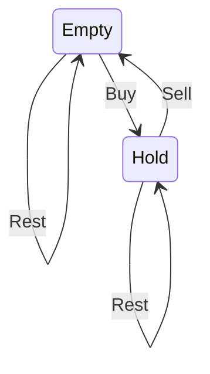

# 714. Best Time to Buy and Sell Stock with Transaction Fee

https://leetcode.com/problems/best-time-to-buy-and-sell-stock-with-transaction-fee/

---

# Description

Your are given an array of integers `prices`, for which the `i`-th element is the price of a given stock on day `i`; and a non-negative integer `fee` representing a transaction fee.

You may complete as many transactions as you like, but you need to pay the transaction fee for each transaction. You may not buy more than 1 share of a stock at a time (ie. you must sell the stock share before you buy again.)

Return the maximum profit you can make.

**Example 1**:

<pre><code>
<b>Input</b>: prices = [1, 3, 2, 8, 4, 9], fee = 2
<b>Output</b>: 8
<b>Expanation</b>: The maximum profit can be achieved by:
Buying at prices[0] = 1
Selling at prices[3] = 8
Buying at prices[4] = 4
Selling at prices[5] = 9
The total profit is ((8 - 1) - 2) + ((9 - 4) - 2) = 8.
</code></pre>

**Note**:

- `0 < prices.length <= 50000`.
- `0 < prices[i] < 50000`.
- `0 <= fee < 50000`.

---

# Solution

## 1. Dynamic Programming

dp[i][0] is the max account balance if there is no stock on hold;

dp[i][1] is the max account balance if there is a stock on hold.

**Python**
```python
class Solution:
    def maxProfit(self, prices: List[int], fee: int) -> int:
        # DP
        # DP[i][j] max_profit at i-th day for j = 0 empty and j = 1 hold
        
        if len(prices) <= 1: return 0
        DP = [[0,0] for _ in range(len(prices))]
        DP[0][1] = -prices[0]
        for i in range(1, len(prices)):
            # empty = max(empty, sell)
            DP[i][0] = max(DP[i-1][0], DP[i-1][1] + prices[i] - fee) 
            # hold = max(hold, buy)
            DP[i][1] = max(DP[i-1][1], DP[i-1][0] - prices[i])
        return DP[-1][0]
```

**Time Complexity** : $O(n)$

**Space Complexity** :$O(n)$

## 2. State Machine Thinking

In this question, there are two states and four edges in the state transition.



3 states are notHold (stock), hold (stock). The initial values of hold is negative infinity since it is meaningless, i.e. you won't hold stocks at first.

**Python**
```python
class Solution:
    def maxProfit(self, prices: List[int], fee: int) -> int:
        empty, hold = 0, float('-inf')
        for p in prices:
            empty, hold = max(empty, hold + p - fee), max(hold, empty - p)
            
        return empty
```

**Time Complexity** : $O(n)$

**Space Complexity** :$O(1)$